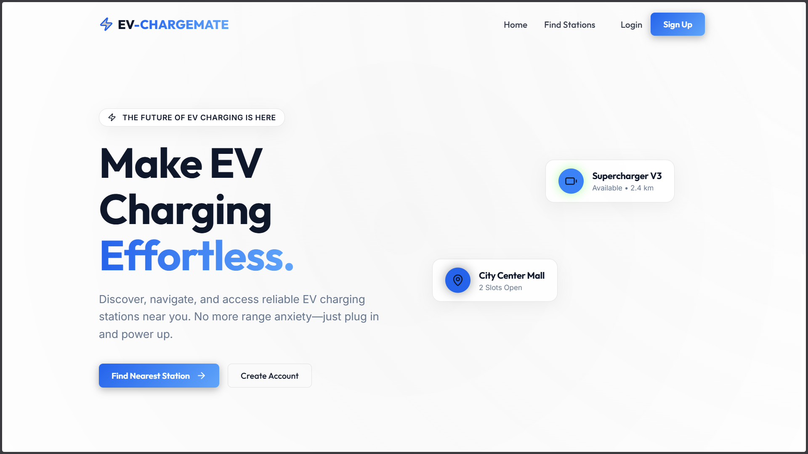
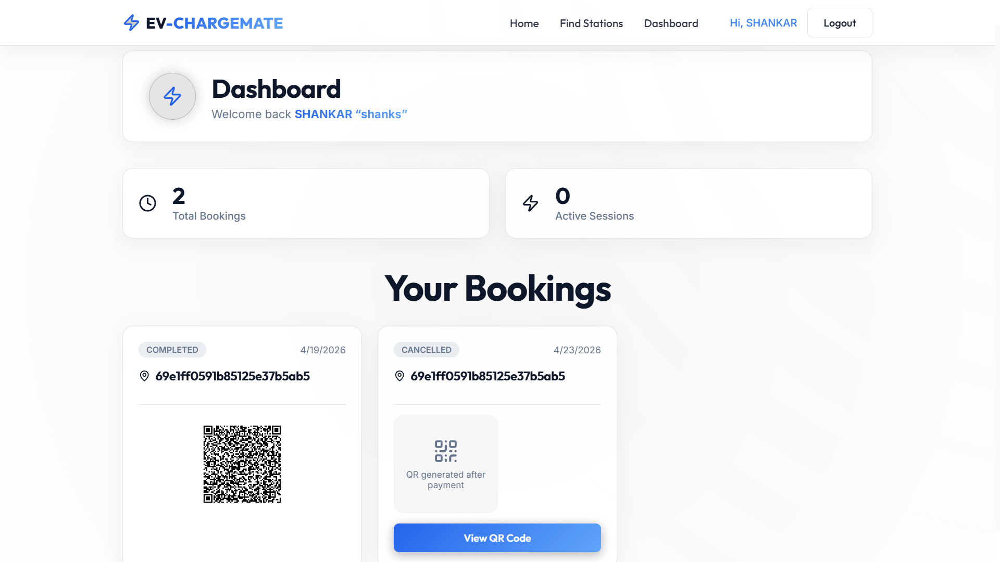
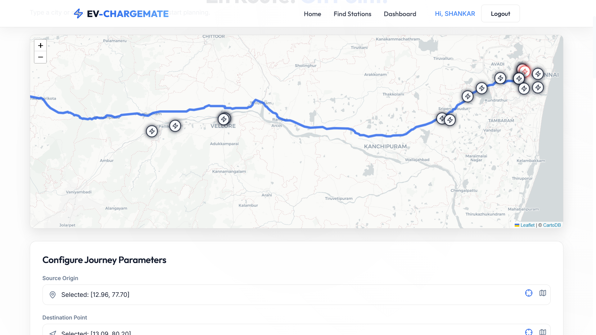
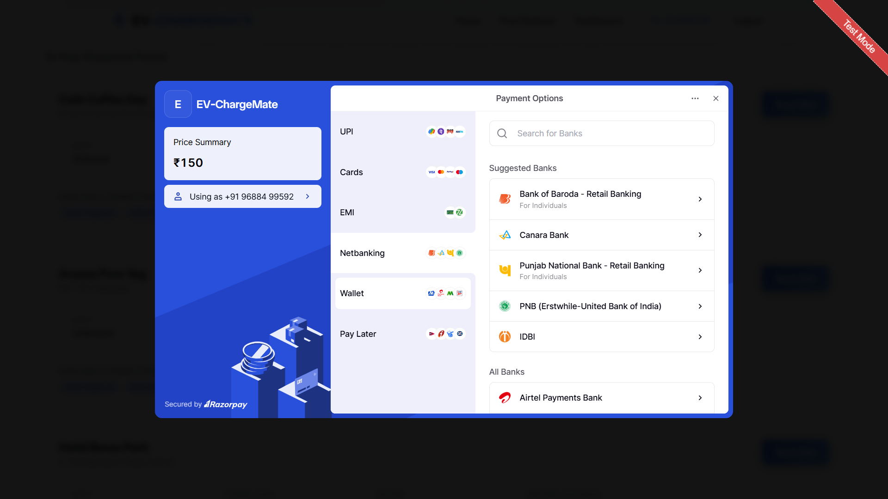
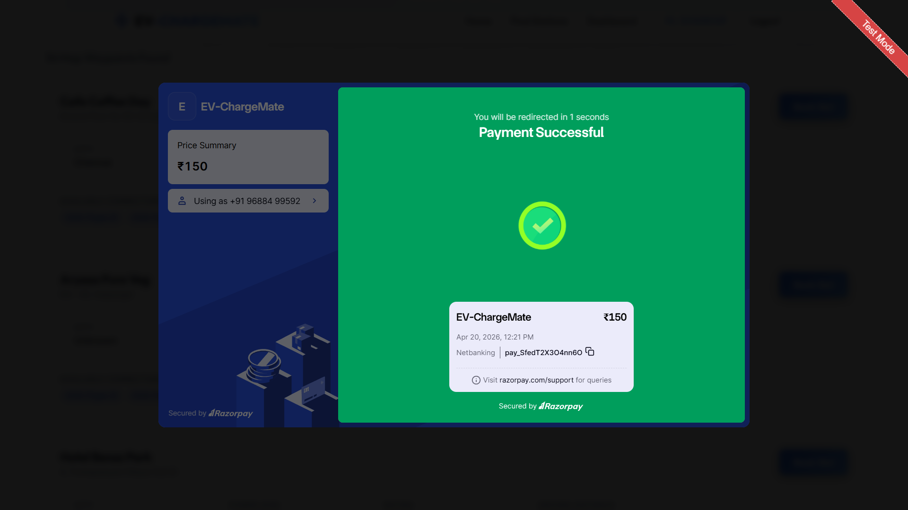
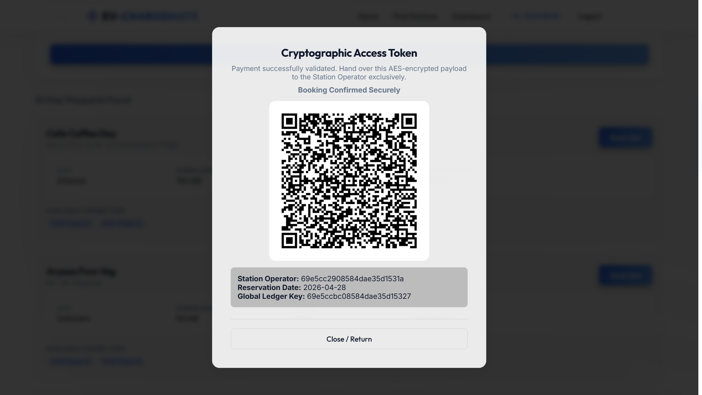

# ⚡ EV-ChargeMate

A full-stack EV charging management platform that enables users to book charging slots, complete secure payments, and activate charging sessions via QR-based hardware verification.

---

## 🌐 Live Demo

- **Frontend:** https://evchargemate.vercel.app  
- **Backend API:** https://evchargemate-backend.onrender.com  
- **Station Portal:** https://evchargemate.vercel.app/#/station  

---

## 📌 Overview

EV-ChargeMate simulates a real-world EV charging ecosystem with three core layers:

- **User Platform** – booking, payments, dashboard  
- **Admin System** – station management  
- **Station Interface** – QR-based verification  

The system ensures secure and real-time interaction between users and charging stations.

---

## 🖼️ Screenshots

**Home**


**Dashboard**


**Stations**


**Payment**


**Payment-Success**


**QR Confit**



---

## ⚙️ Features

### 👤 User
- Register / Login (JWT + Google OAuth)
- Browse charging stations
- Book charging slots
- Razorpay payment integration
- QR code generation after payment
- Dashboard with booking history

---

### 🛠️ Admin
- Manage stations
- Role-based access control
- Monitor bookings

---

### 🔌 Station (Hardware Simulation)
- Access via: `/#/station`
- Authenticate using `stationId` + `stationSecret`
- Scan or paste encrypted QR data
- Confirm booking → start charging
- Cancel booking → trigger refund logic

---

## 🔐 Authentication & Security

- JWT stored in **HTTP-only cookies**
- Cross-site cookies enabled (`SameSite=None`, `Secure=true`)
- Google OAuth 2.0 integration
- Station-level cryptographic validation
- Booking lifecycle protection

---

## 💳 Payment Flow

1. User books a slot  
2. Backend creates Razorpay order  
3. Payment is completed  
4. Backend verifies payment  
5. QR code is generated  
6. Station scans QR → charging starts  

---

## 🧠 Architecture

```
Frontend (React + Vite)
        ↓
Backend (Node.js + Express)
        ↓
Database (MongoDB)
```

---

## 🚀 Deployment

### Frontend
- Hosted on **Vercel**
- Uses **HashRouter (`/#/route`)** to prevent 404 on refresh

### Backend
- Hosted on **Render**
- Environment-based configuration

---

## ⚙️ Environment Variables

### Backend

```
CLIENT_URL=https://evchargemate.vercel.app
JWT_SECRET=SECRET🤫
MONGO_URI=_db_url
RAZORPAY_KEY_ID=SECRET🤫
RAZORPAY_SECRET=SECRET🤫
```

---

### Frontend

```
VITE_API_URL=https://evchargemate-backend.onrender.com
```

---

## 📦 Tech Stack

- **Frontend:** React, Vite, React Router  
- **Backend:** Node.js, Express  
- **Database:** MongoDB  
- **Auth:** JWT, Google OAuth  
- **Payments:** Razorpay  
- **Deployment:** Vercel, Render  

---

## 🧪 Challenges Solved

- OAuth redirect mismatch  
- Vercel SPA routing (404 issue)  
- Cross-origin cookies handling  
- Payment + booking synchronization  
- Secure hardware validation system  

---

## 🔮 Future Improvements

- Real-time updates (WebSockets)  
- Mobile app  
- Map-based station discovery  
- Load balancing for stations  

---

## 👨‍💻 Developers

**Shankar V**

---

## ⭐ Support

If you found this project useful, consider giving it a ⭐ on GitHub.
